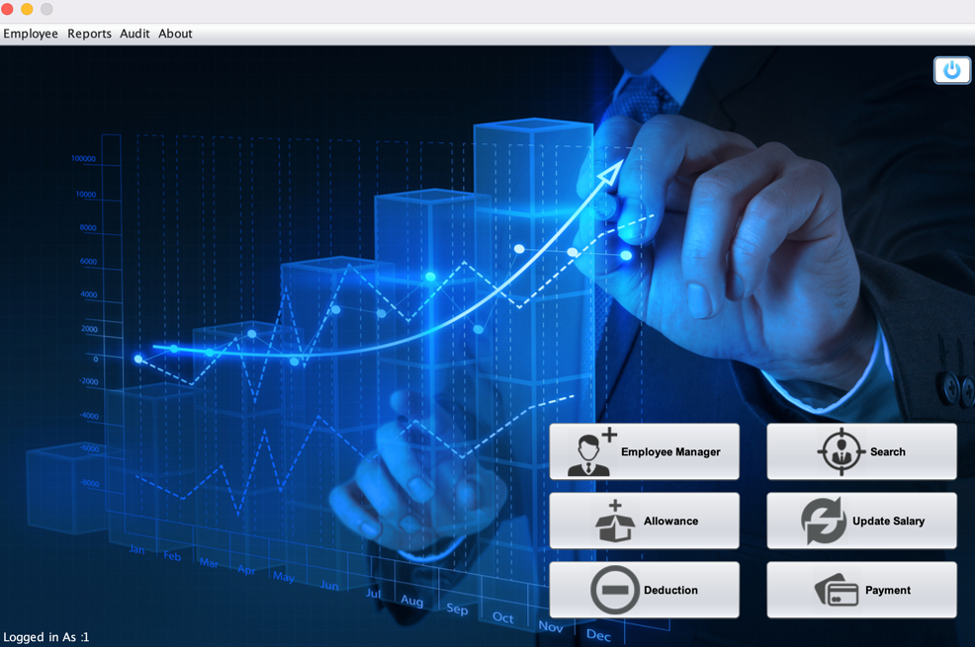
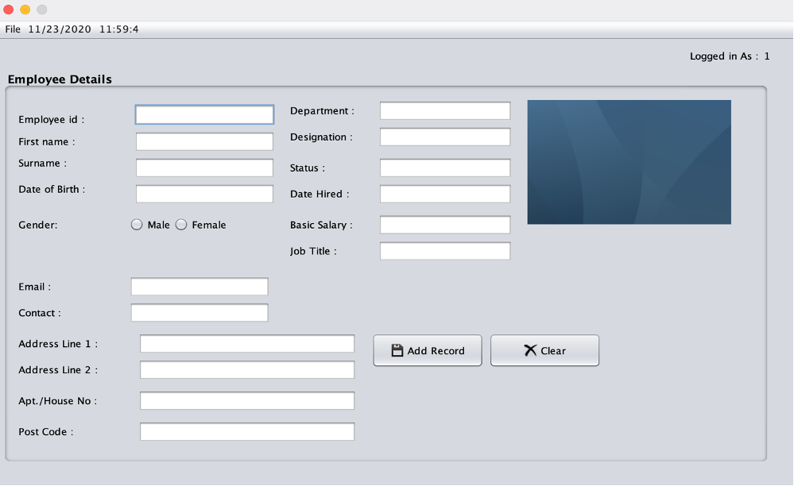
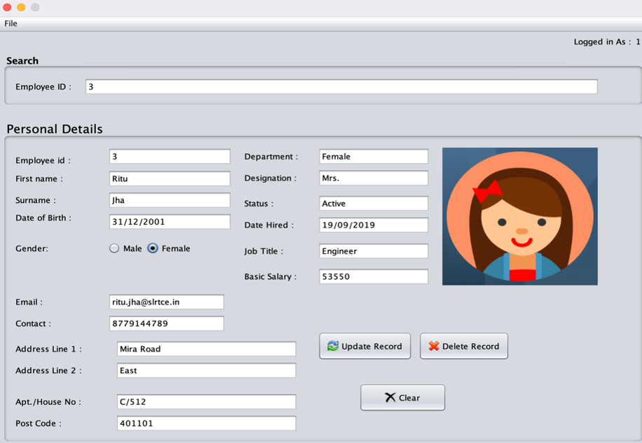
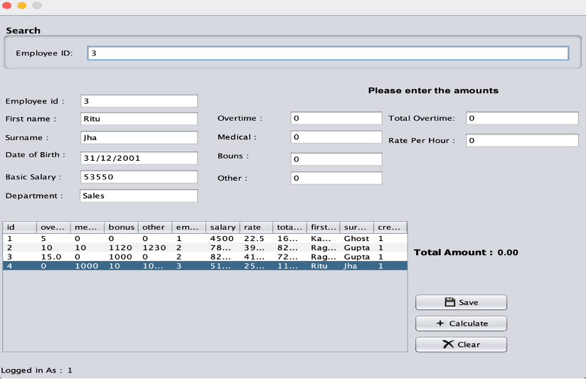
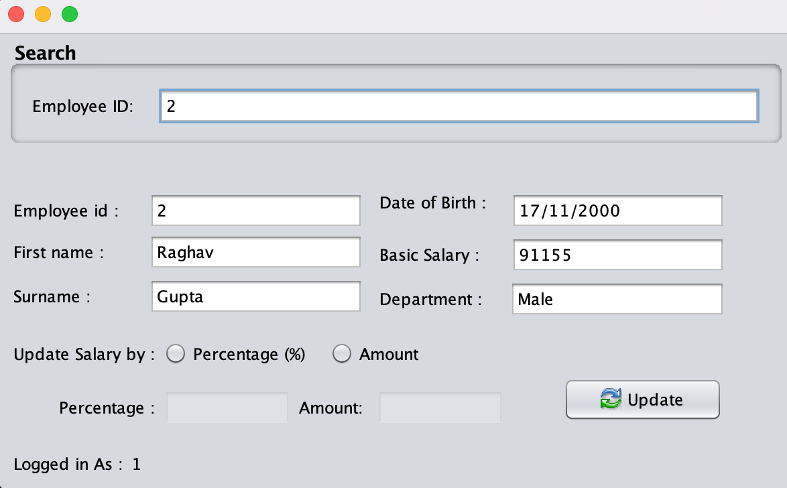
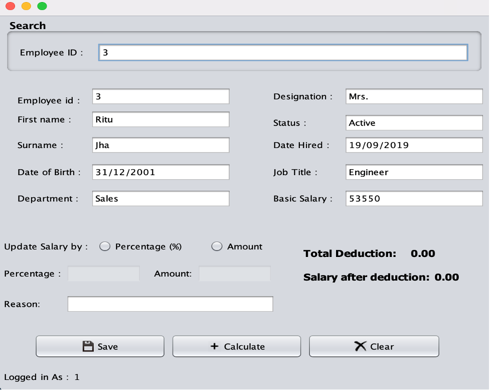
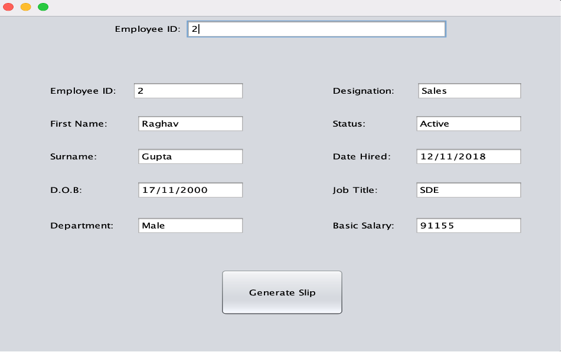
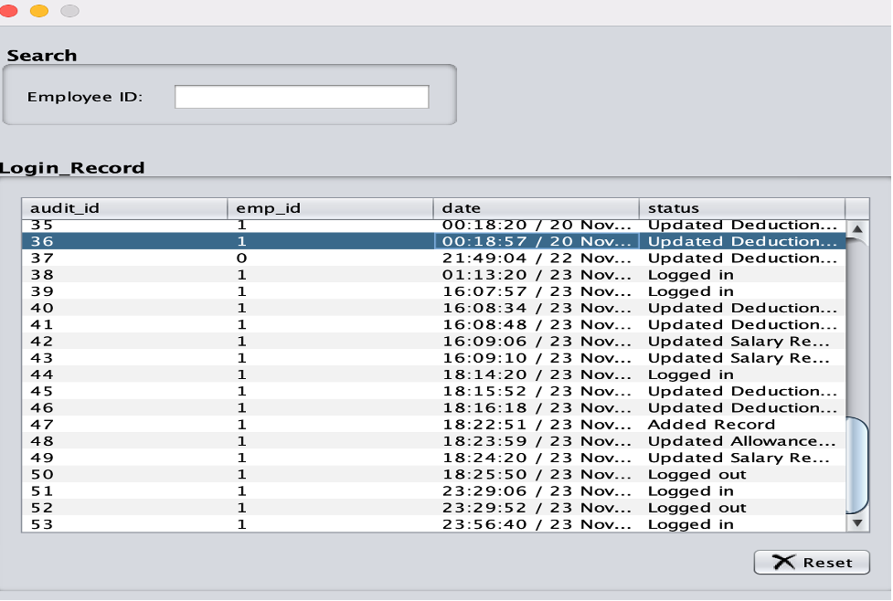

<h1>INTRODUCTION</h1>

•	The employee payroll management system is a Java project developed using NetBeans with 
  backend SQLite as the database.
  
•	In this project, the user will find the login module appearing on the home page. 

•	When the user gets logged in the system, he can then do the following features: 
  Register Employee, Search Employee, Search Employee Salary, Deduction Payment, 
  Check Allowance, more features are available in this project as you can even 
  generate the Salary Report of the employee.
  
•	The user has to enter the username and password in order to get logged into 
  the system as the system administrator.
  
•	 Also, you can audit the employee record and salary. You can even generate the 
   slip of the payment made to the employee. This project allows you to insert 
   profile images during adding or registering the employee.
   
•	The main objective of the Java Project on Payroll Management System is to manage 
  the details of Employees, Payments, Salary. It also manages all information about
  the Employee, Payroll and Salary Slips. 
  
•	The project is totally built at administrator end of things. Only the administrator
  is guaranteed the access. The purpose of the project is to build an application that 
  reduces the manual work and it can be used as a school project.
  
  
  **LOGIN SCREEN** :
  First when the Project starts, “LOGIN SCREEN” will be visible.
  
  
  **MAIN MENU** : After successfully logging in the user will get 6 options. 
  
  ~EMPLOYEE MANAGER
  
  ~SEARCH EMPLOYEE
  
  ~ALLOWANCE
  
  ~UPDATE SALARY
  
  ~DEDUCTION 
  
  ~PAYMENT
  
  
  
  **EMPLOYEE MANAGER**:In which we can Add or Delete Employee
  
  
  
  **SEARCH EMPLOYEE**:: You can Search Employee Details
  
  
  
  **ALLOWANCE**: If an employee does an Overtime or gets a Bonus ,so money will be added to his/her Basic Salary. 
  
  
  
  **UPDATE SALARY**: If want to increase or decrease the salary.
  
  
  
  **DEDUCTIONS** : If one want to deduct the salary.
  
  
  
  **PAYMENT** : Will make a Salary slip in .pdf format.
  
  
  
  **AUDIT DETAILS** : Keep a track of when we have logged in or out.
  
  
  
  
  
  
